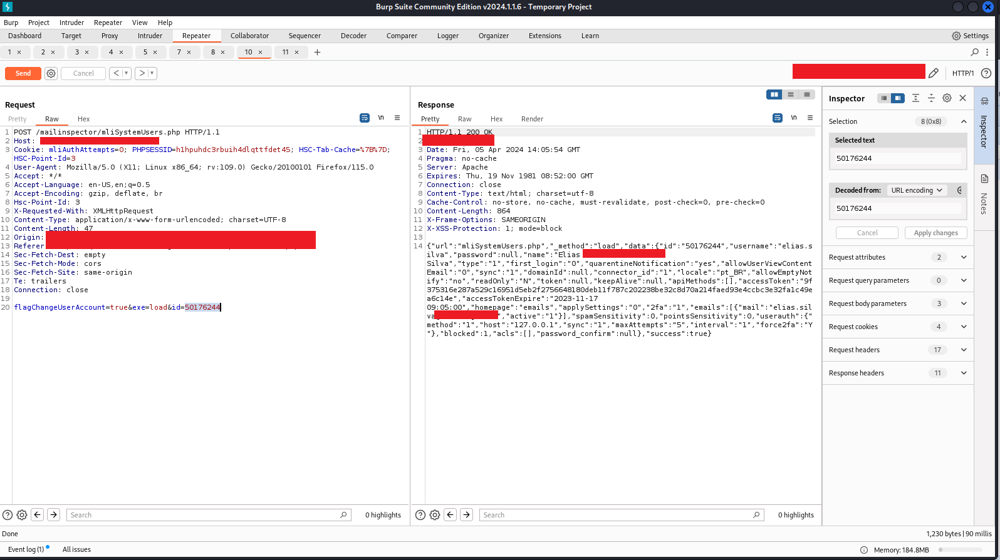

# CVE-2024-32369

## Vulnerability Description

### Issue
An issue in HSC Cybersecurity HSC Mailinspector version 5.2.17-3 has been identified, allowing a remote attacker to obtain sensitive information via a crafted payload to the `id` parameter in the `mliSystemUsers.php` component.

### Vulnerable Component
- **Component:** `mliSystemUsers.php`
- **Version:** 5.2.17-3 up to 5.2.18

### Vulnerable Parameter
- **Parameter:** `id`
- **Payload:** `flagChangeUserAccount=true&exe=load&id=501762441`

### Vulnerability Explanation
The vulnerability arises due to insufficient input validation and sanitization of the `id` parameter in the `mliSystemUsers.php` component. Attackers can exploit this flaw by sending a specially crafted payload to the `id` parameter, enabling them to obtain sensitive information from the system.

### Attack Scenario
A remote attacker can exploit this vulnerability by manipulating the `id` parameter in the payload. By sending a crafted request with a malicious `id` value, the attacker can trick the application into disclosing sensitive information, such as user account details or system configuration data.

### Impact
If successfully exploited, the vulnerability could lead to the unauthorized disclosure of sensitive information stored within the HSC Mailinspector system. This information disclosure may include user credentials, email content, or other confidential data, posing a significant risk to the confidentiality and integrity of the system.

